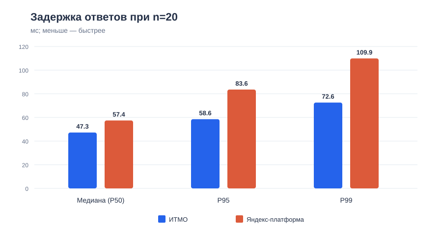
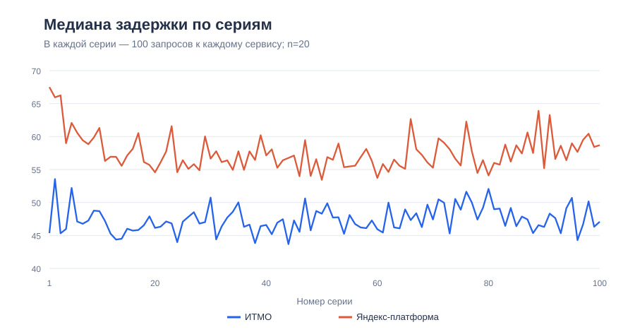

# Сравнение сервисов вычисления чисел Фибоначчи

## Цель и условия

Сравнить задержку двух опубликованных сервисов при **одинаковом входном значении `n=20`**.

| Сервис | Адрес запроса |
| --- | --- |
| ИТМО | `https://se.ifmo.ru/~t228350/fib/?n=20` |
| Яндекс-платформа | `https://d5d66jnup3jc4l3m64r8.apigw.yandexcloud.net/?n=20` |

Использован [сценарий k6](k6-benchmark.js). Он задаёт 100 серий по 100 запросов к каждому сервису (всего по 10 000). Запросы внутри серии отправляются группами по 10 параллельных; серии обслуживает один виртуальный пользователь k6. Порядок сервисов меняется от серии к серии. Для каждого ответа проверяются HTTP 200, `n=20` и `result=6765`.

Команда `npm run benchmark` сначала запускает 30-секундный прогрев через `prebenchmark`, затем основной прогон. Отдельный журнал прогрева не сохранён, поэтому его фактическое выполнение нельзя подтвердить по результатам. Основной прогон занял **230,7 с**.

## Результаты

Источник чисел — [сводка k6](results/k6/summary.json); распределение по сериям рассчитано из [сырых измерений](results/k6/metrics.jsonl). Задержка - `http_req_duration`: время отправки запроса, ожидания ответа и получения тела, без времени блокировки перед запросом.

| Показатель | ИТМО | Яндекс-платформа |
| --- | ---: | ---: |
| Количество запросов | 10 000 | 10 000 |
| Корректные ответы / HTTP 200 | 10 000 / 10 000 | 10 000 / 10 000 |
| Средняя задержка | 49,99 мс | 61,09 мс |
| Медиана (P50) | 47,26 мс | 57,42 мс |
| P95 | 58,56 мс | 83,57 мс |
| P99 | 72,57 мс | 109,89 мс |
| Максимум | 2840,59 мс | 2190,97 мс |



Медиана Яндекс-платформы выше на **10,16 мс** (примерно на 21,5%), P95 — на **25,01 мс** (примерно на 42,7%). Средняя задержка выше на **11,10 мс**, или на **22,2%** относительно ИТМО. Отдельные выбросы влияют на среднее; поэтому вывод опирается также на медиану и верхние процентили.



При сравнении средних задержек соответствующих серий Яндекс-платформа медленнее в **96 из 100** пар. Средняя парная разница (Яндекс − ИТМО) равна **11,10 мс**. Оценка 95% доверительного интервала для этой разницы — **5,66–15,28 мс**: процентильный bootstrap по 100 парам серий, 20 000 повторных выборок, seed 42. Это описывает неопределённость **внутри данного прогона**, а не изменение условий между независимыми прогонами.

## Анализ

Среднее время ожидания ответа (`http_req_waiting`) составило **49,66 мс** для ИТМО и **60,81 мс** для Яндекс-платформы. Разница (**11,16 мс**) близка к разнице общей средней задержки. Среднее время отправки запроса было около **0,19 мс** у обоих сервисов, время получения тела — менее **0,14 мс**. Таким образом, наблюдаемая разница в основном возникает **до первого байта ответа**.

В рамках измеренного сценария **медленнее сервис на Яндекс-платформе**: у него выше типичная и хвостовая задержка, а большинство пар серий подтверждают тот же порядок. На время ожидания могут влиять обработка запроса, промежуточный шлюз, сеть и загрузка серверов.

## Воспроизведение и исходные файлы

```sh
npm run benchmark
```

Команда перезаписывает файлы в `results/k6/`. Сохранённые артефакты текущего прогона: [интерактивный отчёт k6](results/k6/report.html), [сводка](results/k6/summary.json) и [сырые метрики](results/k6/metrics.jsonl). Два SVG-графика выше построены по этим метрикам; первый показывает P50/P95/P99 всего прогона, второй - медиану каждой серии из 100 запросов.
